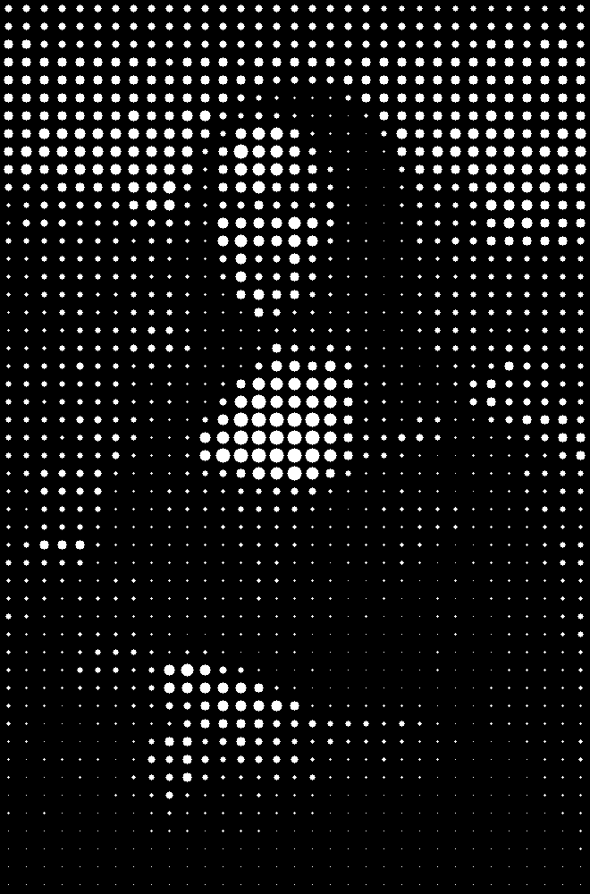
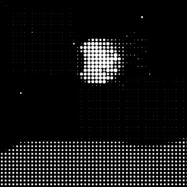

# .pfp

Pronounced dotpfp, is a tool to convert your picture to a dot-enveloped piece of art -- so you can use it for your internet identity.

<a href="https://aryanbaburajan.github.io/dotpfp"><kbd> Convert  </kbd></a>

 

   
  

  
   

  
   

